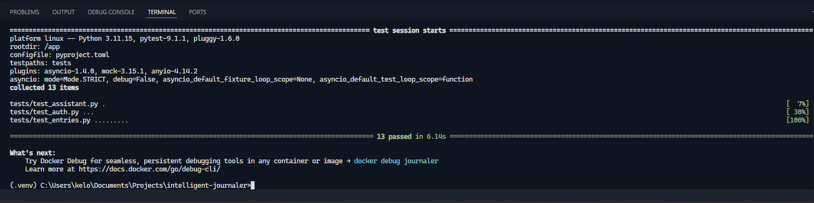
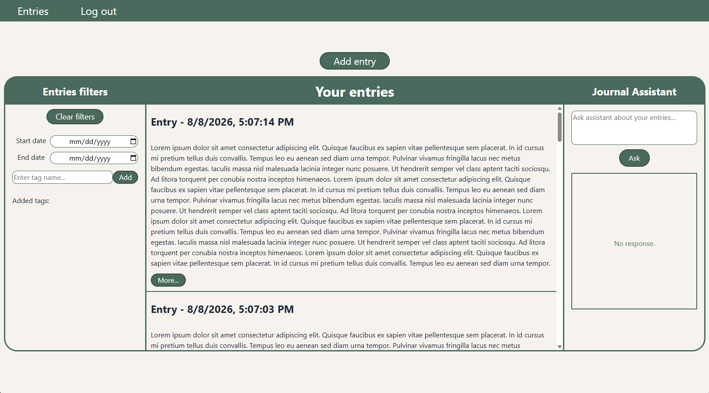
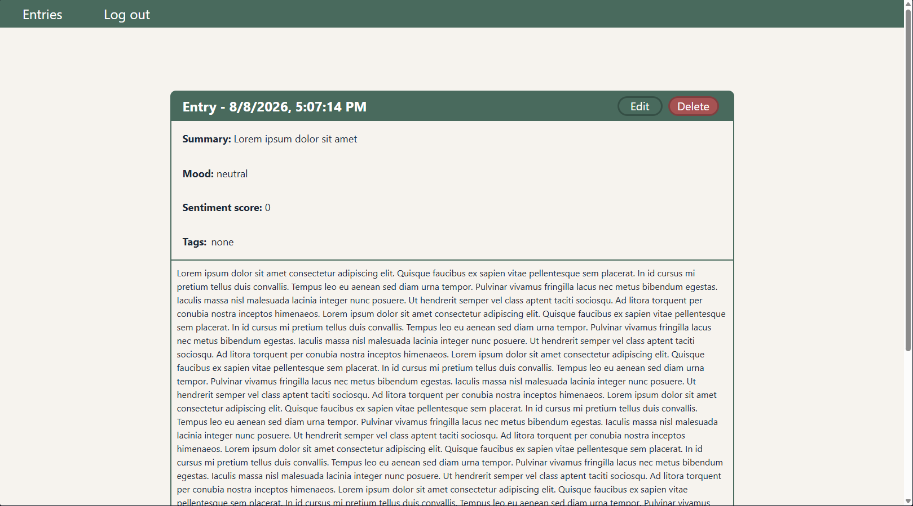

## About the Project

Intelligent Journaler is a web application for managing journal entries, featuring an AI-powered assistant that generates insights based on entry content.

Users can create, view, update, and delete entries, as well as filter them by date and tags. The assistant can also help create new entries and find specific information within the user's journal.

The AI features are powered by the OpenAI API. An API key is required to use the real AI integration locally. For security and cost-control purposes, the version deployed on Render uses mock AI responses.


## Features

- JWT Authentication — secure user registration and sign-in.
- Entry Management — create, view, update, and delete journal entries.
- Filtering — filter entries by tags and date.
- AI-Generated Insights — generate insights based on journal entry content.
- RAG-Based Search — retrieve relevant information from existing entries.
- AI Function Calling — allow the assistant to perform supported journal operations.
- React Frontend — responsive user interface built with React.

## Showcase

### Video Demo

[Watch the Intelligent Journaler demo](https://youtu.be/3vyLvhI-QzU)

> The video demonstrates the application's main features using the deployed version on Render. The AI assistant is shown running locally with the real OpenAI integration, while the deployed version uses mock AI responses for security and cost-control purposes.

### Live Demo

Try the deployed application: [Intelligent Journaler](https://intelligent-journaler.onrender.com)

## Screenshots

### Tests



### Homepage


### Journal Dashboard



### Entry details



### AI assistant


## Installation

### Prerequisites

Make sure Git, Docker Desktop, and Node.js are installed.

### 1. Clone the repository

```
git clone https://github.com/Kelooo0/intelligent-journaler.git
cd intelligent-journaler
```

### 2. Configure environment variables

Navigate to the backend directory, create a .env file based on .env.example, set SECRET_KEY to a long and secure value, and optionally provide your OpenAI API key:

```
cd backend
cp .env.example .env

SECRET_KEY=your-secure-secret-key
API_KEY=your-openai-api-key
```

The API key can be generated on the [OpenAI Platform](https://platform.openai.com/). If left empty, real AI features will not be available.

Next, create the frontend environment file:

```
cd ../frontend
cp .env.example .env
```

### 3. Run the application

Make sure Docker Desktop is running. From the project root directory, start the backend services:

```
docker compose --env-file ./backend/.env up -d --build
```

Then install the frontend dependencies and start the development server:

```
cd frontend
npm install
npm run dev
```

The application will be available at http://localhost:5173.
